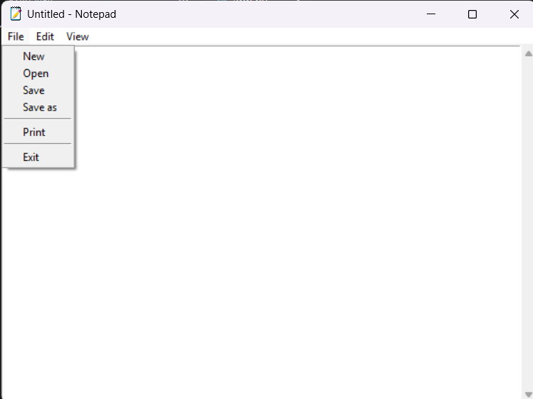

# Text Editor

A simple text editor built using Python and Tkinter.

## Features

* Create a new document
* Open existing text files
* Save files
* Save files with a new name (Save As)
* Undo changes
* Redo changes
* Cut text
* Copy text
* Paste text
* Select all text
* Go To Line navigation
* Dynamic menu state management

  * Cut and Copy are disabled when the editor is empty
  * Paste is disabled when the clipboard is empty
* Vertical scrollbar
* Custom application icon

## Note

The following features are currently under development:

* Delete selected text
* Zoom In / Zoom Out
* Restore Default Zoom
* Status Bar
* Print Support

## Screenshot



## Requirements

* Python 3.8+ (tested on Python 3.13.5)

## Run Locally

```bash
git clone https://github.com/LokjitKundu/text_editor_tkinter.git

cd text_editor_tkinter

python run.py
```

## Project Structure

```text
text_editor_tkinter/
│
├── assets/
│   └── text_editor_icon.ico
│
├── screenshots/
│   └── text_editor_screenshot.png
│
├── app.py
│
├── run.py
│
├── LICENSE
│
├── .gitignore
│
└── README.md
```

## Author

Lokjit Kundu